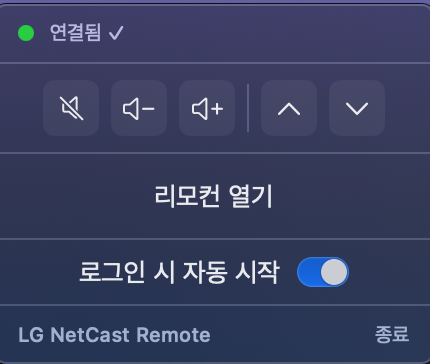
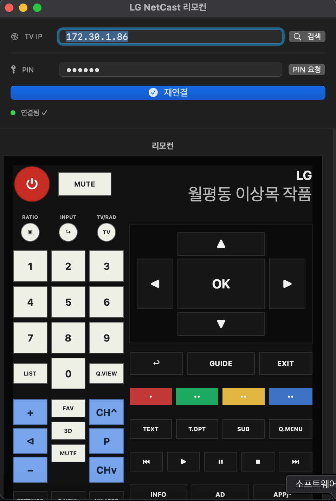

# LG NetCast Remote

LG NetCast TV (레거시 HDCP API) 를 macOS 메뉴바에서 제어하는 네이티브 Swift 앱입니다.

> 대상 기기: LG NetCast TV (42LW5700 등, 2014년 이전 모델) — 포트 8080 HDCP API 사용

---

## 스크린샷

 

---

## 요구사항

| 항목 | 버전 |
|---|---|
| macOS | 13 Ventura 이상 |
| Swift | 5.9 이상 |
| Xcode / Swift toolchain | 필요 |

---

## 빌드 및 실행

```bash
# 빌드 (release, .app 번들 자동 생성 후 ZIP 백업 실행)
./build.sh

# 빌드 후 바로 실행
./run.sh

# debug 모드
./build.sh debug
./run.sh debug

# SPM으로 바로 실행 (개발용)
swift run
```

빌드 완료 후 프로젝트 루트에 생성되는 파일:

- `LGNetCastRemote.app` — Finder에서 더블클릭으로 실행 가능한 앱 번들
- `LGNetCastRemote` — 단독 바이너리 (참고용)
- `../LGNetCastRemote_YYYYMMDD_HHMMSS_.zip` — 빌드 완료 후 자동 생성되는 프로젝트 백업 ZIP

### Xcode에서 열기

```bash
open Package.swift
```

---

## 사용 방법

1. **앱 실행** → 메뉴바에 LG 아이콘 표시
2. **자동 연결** → 저장된 IP·PIN이 있으면 시작 시 자동 연결  
   PIN이 없으면 TV 화면에 자동으로 PIN 표시 요청
3. **리모컨 열기** → 메뉴바 아이콘 클릭 → "리모컨 열기"
4. **TV 검색** → 검색 버튼으로 네트워크 자동 탐색 (SSDP → B-SEARCH → 포트 스캔 순)
5. **PIN 입력 후 연결** → 리모컨 버튼 활성화
6. 이후 실행 시 저장된 IP·PIN으로 **자동 연결**

---

## 메뉴바 퀵버튼

연결 시 메뉴바 팝업에 퀵버튼이 표시됩니다.

| 버튼 | 기능 | 색상 |
|---|---|---|
| 🔇 | Mute | 노란색 |
| 🔉 🔊 | 볼륨 +/- | 흰색 |
| CH ∧ / CH ∨ | 채널 업/다운 | 파란색 |

볼륨·채널 버튼은 꾹 누르면 연속 입력됩니다.

---

## TV 통신 프로토콜

| 항목 | 내용 |
|---|---|
| 포트 | 8080 |
| 기본 URL | `http://<ip>:8080/hdcp/api` |
| Content-Type | `application/atom+xml` |
| User-Agent | `iPhone` |

| 동작 | 엔드포인트 | XML |
|---|---|---|
| PIN 표시 | `/hdcp/api/auth` | `<auth><type>AuthKeyReq</type></auth>` |
| 인증 | `/hdcp/api/auth` | `<auth><type>AuthReq</type><value>PIN</value></auth>` |
| 키 전송 | `/hdcp/api/dtv_wifirc` 또는 `/hdcp/api/command` | `<command><session>…</session><type>HandleKeyInput</type><value>코드</value></command>` |

---

## 기기 자동 탐색 순서

1. **SSDP M-SEARCH** — UDP 멀티캐스트 `239.255.255.250:1900` (5초 대기)
2. **B-SEARCH** — UDP 브로드캐스트 `255.255.255.255:1990`
3. **포트 스캔** — 활성 네트워크 인터페이스(`en*`) 전체 `/24` 서브넷 TCP 8080 확인

저장된 IP가 있으면 탐색 결과와 무관하게 항상 후보로 포함됩니다.

---

## 파일 구조

```
LGTV_Swift/
├── Package.swift
├── Sources/LGNetCastRemote/
│   ├── LGNetCastApp.swift           # @main, MenuBarExtra, AppDelegate
│   ├── TVController.swift           # 네트워크 통신, 인증, 키 전송, 기기 탐색
│   ├── SSDPDiscovery.swift          # SSDP / B-SEARCH / 포트 스캔
│   ├── KeyMap.swift                 # LGKey enum (키 코드 매핑)
│   ├── TVState.swift                # 모델: ConnectionState, TVDevice
│   ├── StateManager.swift           # JSON 설정 저장/불러오기
│   ├── LaunchAgentManager.swift     # 로그인 시 자동 시작
│   ├── MenuBarView.swift            # 메뉴바 팝업 UI (퀵버튼 포함)
│   ├── ConnectionView.swift         # IP·PIN 연결 패널
│   ├── RemoteView.swift             # 전체 리모컨 스킨
│   └── Resources/
│       ├── LGNetCast.icns           # 앱 아이콘 (LG 로고)
│       └── lg_menu_icon.png         # 메뉴바 아이콘 (22×22, LG 로고)
├── assets/                          # 원본 아이콘 소스 (iconset 포함)
├── image/                           # 스크린샷 및 로고
├── build.sh                         # 빌드 + .app 번들 생성
├── run.sh                           # 빌드 후 실행
└── backup.sh                        # 프로젝트 ZIP 백업
```

---

## 설정 저장 위치

```
~/Library/Application Support/LG NetCast Remote/lg_remote_state.json
```

---

## 로그인 자동 시작

메뉴바 팝업의 **"로그인 시 자동 시작"** 토글로 제어합니다.

LaunchAgent 경로: `~/Library/LaunchAgents/com.kadelee.lgnetcast.menubar.plist`

---

## 백업

```bash
./backup.sh
# → ../LGNetCastRemote_20260319_120000_.zip
```

`.build/`, `.git/`, 바이너리는 백업에서 제외됩니다.

---

월평동 이상목 작품
